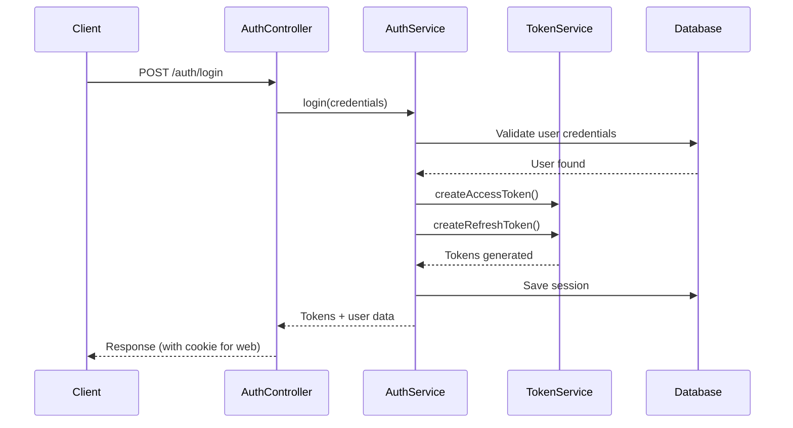

## Overview

Rodando Backend implements a robust JWT-based authentication system with dual-token architecture, supporting multiple client types (web, mobile, admin) and comprehensive session management.

## Authentication Flow



## Dual-Token Architecture

The system uses two types of JWT tokens:

### Access Token

Short-lived token used for API requests.

<CodeGroup>
```typescript Payload Structure
{
  sub: string;              // User ID
  email?: string;           // User email
  phoneNumber?: string;     // User phone
  sid: string;              // Session ID (jti)
  aud: AppAudience;         // Audience (DRIVER_APP, PASSENGER_APP, etc.)
  userType: UserType;       // DRIVER, PASSENGER, ADMIN
  iss: string;              // Issuer
  exp: number;              // Expiration timestamp
}
```

```typescript Creating Access Token
// src/modules/auth/services/auth.service.ts:108-117
const { token: accessToken, expiresIn: accessTtl } =
  this.tokenService.createAccessToken({
    sub: user.id,
    email: user.email,
    phoneNumber: user.phoneNumber,
    sid: jti,
    aud: dto.appAudience,
    userType: user.userType,
  });
```
</CodeGroup>

### Refresh Token

Longer-lived token used to obtain new access tokens.

<CodeGroup>
```typescript Creating Refresh Token
// src/modules/auth/services/auth.service.ts:96-105
const {
  token: refreshToken,
  jti,
  expiresIn: refreshTtl,
} = this.tokenService.createRefreshToken({
  sub: user.id,
  email: user.email,
  phoneNumber: user.phoneNumber,
});
```

```typescript Verifying Refresh Token
// src/modules/auth/services/auth.service.ts:232-238
const payload = this.tokenService.verifyRefreshToken<{
  sub: string;
  email?: string;
  phoneNumber?: string;
  jti: string;
}>(oldRefreshToken);
```
</CodeGroup>

## Audience-Based Access Control

The system enforces role-based access based on the `appAudience` field:

```typescript src/modules/auth/services/auth.service.ts:34-40
const AUDIENCE_TO_USER_TYPE: Record<AppAudience, UserType> = {
  [AppAudience.DRIVER_APP]: UserType.DRIVER,
  [AppAudience.PASSENGER_APP]: UserType.PASSENGER,
  [AppAudience.ADMIN_PANEL]: UserType.ADMIN,
  [AppAudience.API_CLIENT]: UserType.ADMIN,
};
```

<Info>
  During login and token refresh, the system validates that the user's type matches the required audience.
</Info>

## Session Management

### Session Entity

Each authenticated session is stored in the database:

```typescript Key Session Fields
{
  jti: string;                      // Unique session identifier
  user: User;                       // Associated user
  sessionType: SessionType;         // WEB, MOBILE_IOS, MOBILE_ANDROID
  refreshTokenHash: string;         // Hashed refresh token (security)
  accessTokenExpiresAt: Date;
  refreshTokenExpiresAt: Date;
  deviceInfo: DeviceInfo;           // Device details
  ipAddress: string;
  userAgent: string;
  appAudience: AppAudience;         // Stored for refresh validation
  revoked: boolean;                 // Session revocation flag
  lastActivityAt: Date;
}
```

### Token Reuse Detection

The system prevents refresh token reuse attacks:

```typescript src/modules/auth/services/auth.service.ts:264-301
// Anti-reuse: compare against hash
let matched = false;
try {
  matched = await argon2.verify(session.refreshTokenHash, oldRefreshToken);
} catch {
  matched = false;
}

if (!matched) {
  this.logger.warn(
    'Possible refresh token reuse detected — revoking session',
    { jti: session.jti, userId: session.user?.id },
  );

  session.revoked = true;
  session.revokedAt = new Date();
  session.revokedReason = 'token_reuse_detected';
  await this.sessionRepo.save(session);

  this.eventEmitter.emit(AuthEvents.SessionRevoked, {
    userId: session.user?.id ?? payload.sub,
    sid: session.jti,
    reason: 'token_reuse_detected',
    at: new Date().toISOString(),
  });

  throw new UnauthorizedException('Refresh token inválido o revocado');
}
```

<Warning>
  If token reuse is detected, the session is immediately revoked and a security event is emitted.
</Warning>

## Authentication Endpoints

### Login

<CodeGroup>
```bash cURL Request
curl -X POST http://localhost:3000/auth/login \
  -H "Content-Type: application/json" \
  -d '{
    "email": "driver@example.com",
    "password": "securePassword123",
    "appAudience": "DRIVER_APP"
  }'
```

```typescript Response
{
  "accessToken": "eyJhbGciOiJIUzI1NiIsInR5cCI6IkpXVCJ9...",
  "refreshToken": "eyJhbGciOiJIUzI1NiIsInR5cCI6IkpXVCJ9...", // Mobile only
  "sessionType": "MOBILE_IOS",
  "accessTokenExpiresAt": 1710847200000,
  "refreshTokenExpiresAt": 1713525600000,
  "userType": "DRIVER",
  "user": {
    "id": "uuid",
    "name": "John Doe",
    "email": "driver@example.com",
    "phoneNumber": "+1234567890",
    "userType": "DRIVER"
  }
}
```
</CodeGroup>

<Note>
  For web clients, the refresh token is sent as an HttpOnly cookie. For mobile/API clients, it's included in the response body.
</Note>

### Refresh Token

```typescript src/modules/auth/controllers/auth.controller.ts:74-131
@Public()
@Post('refresh')
@HttpCode(HttpStatus.OK)
async refresh(
  @Req() req: Request & { cookies?: Record<string, string> },
  @Body('refreshToken') refreshTokenBody: string,
  @Res({ passthrough: true }) res: ExpressResponse,
): Promise<RefreshResponseDto> {
  const cookieRt = req.cookies?.refreshToken;
  const oldRt = cookieRt ?? refreshTokenBody;

  if (!oldRt) {
    throw new BadRequestException('No refresh token provided');
  }

  const passRes = !!cookieRt;
  const result = await this.authService.refreshTokens(oldRt, passRes ? res : undefined);

  return plainToInstance(RefreshResponseDto, {
    accessToken: result.accessToken,
    ...(result.refreshToken ? { refreshToken: result.refreshToken } : {}),
    accessTokenExpiresAt: result.accessTokenExpiresAt,
    refreshTokenExpiresAt: result.refreshTokenExpiresAt,
    sid: result.sid,
    sessionType: result.sessionType,
  });
}
```

### Logout

```typescript src/modules/auth/services/auth.service.ts:445-522
async logout(oldRefreshToken: string, res?: ExpressResponse): Promise<void> {
  // Extract jti from token
  const payload = this.tokenService.verifyRefreshToken<RefreshTokenPayload>(oldRefreshToken);
  const jti = payload.jti;

  // Find and revoke session
  const session = await this.sessionRepo.findOne({ where: { jti } });
  if (session) {
    session.revoked = true;
    session.revokedAt = new Date();
    session.revokedReason = 'user_logout';
    await this.sessionRepo.save(session);

    // Emit event for real-time disconnection
    this.eventEmitter.emit(AuthEvents.SessionRevoked, {
      userId: session.user?.id,
      sid: session.jti,
      reason: 'user_logout',
      at: new Date().toISOString(),
    });
  }

  // Clear cookie if applicable
  if (res) {
    res.clearCookie('refreshToken', { /* ... */ });
  }
}
```

## JWT Strategy

The JWT strategy validates access tokens on protected routes:

```typescript src/modules/auth/strategies/jwt.strategy.ts:33-55
async validate(payload: any) {
  // Validate that user still exists and is active
  const resp: ApiResponse<User> = await this.usersService.findById(payload.sub);
  if (!resp?.success || !resp.data) {
    throw new UnauthorizedException('Usuario no encontrado o inválido');
  }
  const user = resp.data;

  // Return data for req.user
  return {
    sub: user.id,
    id: user.id,
    aud: payload.aud,
    userType: payload.userType,
    name: user.name,
    email: user.email,
    phoneNumber: user.phoneNumber,
    profilePictureUrl: user.profilePictureUrl,
  };
}
```

## Guards

### JWT Auth Guard

```typescript src/modules/auth/guards/jwt-auth.guard.ts
@Injectable()
export class JwtAuthGuard extends AuthGuard('jwt') {
  constructor(private reflector: Reflector) {
    super();
  }

  // Allow public routes marked with @Public()
  canActivate(context: ExecutionContext) {
    const isPublic = this.reflector.getAllAndOverride<boolean>(IS_PUBLIC_KEY, [
      context.getHandler(),
      context.getClass(),
    ]);
    if (isPublic) return true;
    return super.canActivate(context);
  }
}
```

### Audience Guard

Additional guard to check specific audience requirements on routes.

## Security Features

<CardGroup cols={2}>
  <Card title="Token Rotation" icon="arrows-rotate">
    Every refresh operation generates new tokens and rotates the session ID (jti)
  </Card>
  <Card title="Argon2 Hashing" icon="lock">
    Refresh tokens are hashed with Argon2 before storage
  </Card>
  <Card title="Session Revocation" icon="ban">
    Sessions can be revoked instantly on logout or security events
  </Card>
  <Card title="Device Tracking" icon="mobile">
    Device info, IP, and user agent tracked per session
  </Card>
</CardGroup>

## Best Practices

<AccordionGroup>
  <Accordion title="Client-Side Token Storage">
    - **Web**: Refresh tokens in HttpOnly cookies, access tokens in memory
    - **Mobile**: Store refresh tokens in secure storage (Keychain/Keystore)
    - Never expose refresh tokens in localStorage or sessionStorage
  </Accordion>

  <Accordion title="Token Refresh Strategy">
    - Refresh access tokens proactively before expiration
    - Implement automatic retry with token refresh on 401 errors
    - Handle refresh failures by redirecting to login
  </Accordion>

  <Accordion title="Security Considerations">
    - Always use HTTPS in production
    - Validate audience matches client type
    - Monitor for suspicious session activity
    - Implement rate limiting on auth endpoints
  </Accordion>
</AccordionGroup>

## Related Resources

<CardGroup cols={2}>
  <Card title="API Reference" icon="code" href="/api/auth/login">
    Explore authentication endpoints
  </Card>
  <Card title="WebSocket Authentication" icon="plug" href="/concepts/real-time-communication">
    Learn about real-time connection auth
  </Card>
</CardGroup>