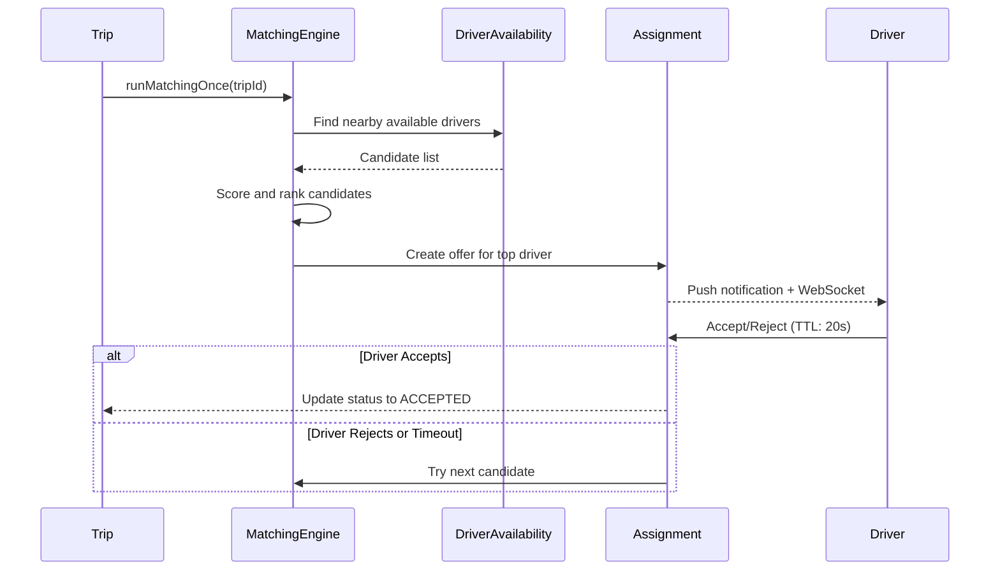

## Overview

The driver matching system uses a sophisticated algorithm to find the best available drivers for incoming trip requests, considering location, vehicle compatibility, driver status, and real-time availability.

## Matching Flow



## Driver Availability System

### Availability Entity

Drivers maintain real-time availability status:

```typescript Driver Availability Structure
{
  id: string;
  driver: User;                         // Driver user entity
  isOnline: boolean;                    // Presence status
  isAvailableForTrips: boolean;         // Matching eligibility
  availabilityReason: AvailabilityReason | null;  // NULL = available, else reason code
  lastLocation: Point;                  // GeoJSON Point (PostGIS)
  lastLocationTimestamp: Date;
  currentTripId?: string;               // Active trip reference
  currentVehicleId?: string;            // Active vehicle
  lastOnlineTimestamp: Date;
  lastPresenceTimestamp: Date;          // Heartbeat tracking
}
```

### Availability Reasons

```typescript src/modules/drivers-availability/entities/driver-availability.entity.ts
enum AvailabilityReason {
  OFFLINE = 'offline',           // Driver explicitly offline
  ON_TRIP = 'on_trip',          // Currently serving a trip
  UNAVAILABLE = 'unavailable',   // Failed eligibility checks
}
```

<Info>
  When `availabilityReason` is `null`, the driver is eligible for matching.
</Info>

## Operational Eligibility

Before a driver can receive trip offers, they must pass eligibility checks:

```typescript src/modules/drivers-availability/services/driver-availability.service.ts:573-681
private async checkOperationalEligibility(
  driverId: string,
  currentVehicleId: string | null,
  manager?: EntityManager,
): Promise<{
  ok: boolean;
  vehicleId: string | null;
  details: {
    userOk: boolean;
    profileOk: boolean;
    walletActive: boolean;
    vehicleOk: boolean;
    reason?: string;
  };
}> {
  // 1. User validation
  const user = await this.userRepo.findById(driverId);
  const userOk = !!user &&
    user.userType === UserType.DRIVER &&
    user.status !== UserStatus.BANNED;

  // 2. Driver profile validation
  const profile = await this.driverProfilesRepo.findByUserIdForEligibility(driverId, manager);
  const profileOk = !!profile &&
    profile.isApproved === true &&
    profile.driverStatus === DriverStatus.ACTIVE;

  // 3. Wallet validation
  const walletActive = await this.driverBalanceRepo.isActiveByDriverId(driverId, manager);

  // 4. Vehicle validation
  let vehicleIdToCheck = currentVehicleId;
  if (!vehicleIdToCheck) {
    const candidate = await this.vehiclesRepo.findPrimaryInServiceByDriver(driverId, manager);
    vehicleIdToCheck = candidate?.id ?? null;
  }

  let vehicleOk = false;
  if (vehicleIdToCheck) {
    const vehicle = await this.vehiclesRepo.findById(vehicleIdToCheck);
    if (vehicle) {
      const isInService = vehicle.status === VehicleStatus.IN_SERVICE;
      const belongsToDriver = vehicle.driver?.id === driverId;
      vehicleOk = isInService && belongsToDriver;
    }
  }

  const ok = userOk && profileOk && walletActive && vehicleOk;

  return { ok, vehicleId: vehicleOk ? vehicleIdToCheck : null, details: { userOk, profileOk, walletActive, vehicleOk } };
}
```

<CardGroup cols={2}>
  <Card title="User Status" icon="user-check">
    Driver must be ACTIVE and not BANNED
  </Card>
  <Card title="Profile Approved" icon="certificate">
    Driver profile must be approved and active
  </Card>
  <Card title="Wallet Active" icon="wallet">
    Driver's wallet/balance must be in good standing
  </Card>
  <Card title="Vehicle Ready" icon="car">
    Vehicle must be IN_SERVICE and belong to driver
  </Card>
</CardGroup>

## Location Tracking

Drivers send periodic location pings via WebSocket:

```typescript src/modules/drivers-availability/services/driver-availability.service.ts:382-516
async ingestLocationPing(driverId: string, dto: DriverAvailabilityPingDto) {
  // 1. Ensure driver availability row exists
  await this.driverAvailabilityRepo.ensureForDriver(driverId, {});
  const av = await this.driverAvailabilityRepo.findByDriverId(driverId);

  const now = new Date();
  const hasLocation = typeof dto.lat === 'number' && typeof dto.lng === 'number';

  // 2. Check if driver is matchable
  const isMatchable = av.isOnline === true &&
    av.isAvailableForTrips === true &&
    av.availabilityReason === null &&
    !av.currentTripId;

  let shouldSaveLocation = false;

  // 3. First location seed (always save)
  if (hasLocation && !av.lastLocation) {
    shouldSaveLocation = true;
  }

  // 4. Intelligent location updates
  if (!shouldSaveLocation && hasLocation && isMatchable) {
    const lastWriteTs = Math.max(
      av.lastLocationTimestamp?.getTime() ?? 0,
      av.updatedAt?.getTime() ?? 0,
    );
    const secondsSinceLastWrite = (now.getTime() - lastWriteTs) / 1000;

    const MIN_WRITE_INTERVAL_SECONDS = 3;
    const MAX_LOCATION_AGE_SECONDS = 45;
    const MIN_DISTANCE_METERS = 8;

    if (dto.forceSave) {
      shouldSaveLocation = true;
    } else if (secondsSinceLastWrite >= MAX_LOCATION_AGE_SECONDS) {
      shouldSaveLocation = true;  // Stale location
    } else if (secondsSinceLastWrite >= MIN_WRITE_INTERVAL_SECONDS) {
      // Check distance moved
      const dist = await this.driverAvailabilityRepo.distanceToCurrentLastLocation(
        driverId,
        dto.lng,
        dto.lat,
      );
      if (dist === null || dist >= MIN_DISTANCE_METERS) {
        shouldSaveLocation = true;
      }
    }
  }

  // 5. Update location or just heartbeat
  if (hasLocation && shouldSaveLocation) {
    const saved = await this.driverAvailabilityRepo.updateLocationByDriverId(driverId, {
      lastLocation: toGeoPoint(dto.lat, dto.lng),
      lastLocationTimestamp: dto.reportedAt ? new Date(dto.reportedAt) : now,
      lastPresenceTimestamp: now,
    });

    this.eventEmitter.emit(DriverAvailabilityEvents.LocationUpdated, {
      at: now.toISOString(),
      snapshot: toDriverAvailabilityResponseDto(saved),
    });
  } else {
    // Heartbeat only (no location update)
    const saved = await this.driverAvailabilityRepo.updateLocationByDriverId(driverId, {
      lastPresenceTimestamp: now,
    });
  }
}
```

<Tip>
  The system intelligently throttles location updates based on:
  - **Time since last update**: Only if > 3 seconds
  - **Distance moved**: Must move > 8 meters
  - **Age of data**: Force update if > 45 seconds old
  - **Force flag**: Client can force immediate update
</Tip>

## Finding Nearby Drivers

The matching algorithm uses PostGIS spatial queries:

```typescript Finding Available Drivers (Repository)
// Uses PostGIS ST_DWithin for efficient spatial query
async findNearbyAvailable(
  longitude: number,
  latitude: number,
  radiusMeters: number,
  limit: number,
  ttlSeconds: number,
): Promise<DriverAvailability[]> {
  const qb = this.repo.createQueryBuilder('da')
    .leftJoinAndSelect('da.driver', 'driver')
    .leftJoinAndSelect('da.currentVehicle', 'vehicle')
    .where('da.isOnline = :online', { online: true })
    .andWhere('da.isAvailableForTrips = :avail', { avail: true })
    .andWhere('da.availabilityReason IS NULL')
    .andWhere('da.currentTripId IS NULL')
    .andWhere('da.lastLocationTimestamp > :cutoff', {
      cutoff: new Date(Date.now() - ttlSeconds * 1000),
    })
    .andWhere(
      `ST_DWithin(
        da.lastLocation::geography,
        ST_SetSRID(ST_MakePoint(:lng, :lat), 4326)::geography,
        :radius
      )`,
      { lng: longitude, lat: latitude, radius: radiusMeters },
    )
    .orderBy(
      `ST_Distance(
        da.lastLocation::geography,
        ST_SetSRID(ST_MakePoint(:lng, :lat), 4326)::geography
      )`,
      'ASC',
    )
    .limit(limit);

  return qb.getMany();
}
```

<Note>
  The query filters drivers by:
  - **Online status**: `isOnline = true`
  - **Availability**: `isAvailableForTrips = true` and `availabilityReason IS NULL`
  - **No active trip**: `currentTripId IS NULL`
  - **Fresh location**: Updated within `ttlSeconds` (default 90s)
  - **Proximity**: Within `radiusMeters` of pickup location
  
  Results are sorted by distance (nearest first).
</Note>

## Assignment Process

### Creating an Offer

When a suitable driver is found:

```typescript Trip Assignment Creation
{
  id: string;                       // Assignment UUID
  trip: Trip;                       // Reference to trip
  driver: User;                     // Selected driver
  vehicle: Vehicle;                 // Driver's vehicle
  status: AssignmentStatus;         // Initially OFFERED
  offeredAt: Date;                  // Timestamp of offer
  ttlExpiresAt: Date;              // Auto-expire time (e.g., +20s)
  metadata: {
    etaSeconds: number;             // Estimated time to pickup
    distanceMeters: number;         // Distance to pickup
  };
}
```

### Assignment Statuses

```typescript
enum AssignmentStatus {
  OFFERED = 'offered',       // Pending driver response
  ACCEPTED = 'accepted',     // Driver accepted
  REJECTED = 'rejected',     // Driver declined
  EXPIRED = 'expired',       // TTL timeout
  CANCELLED = 'cancelled',   // Trip cancelled or other assignment accepted
}
```

### Sequential Matching

If a driver rejects or times out:

```typescript src/modules/trip/services/trip.service.ts:629-703
async rejectAssignment(
  assignmentId: string,
  dto: RejectAssignmentDto,
): Promise<ApiResponseDto<{ assignmentId: string; nextAssignmentId?: string; message: string }>> {
  const now = new Date();

  // 1. Mark offer as REJECTED
  const tripId = await withQueryRunnerTx(
    this.dataSource,
    async (_qr, manager) => {
      const a = await this.tripAssignmentRepo.getOfferedById(assignmentId, manager);
      if (!a) throw new ConflictException('Assignment is not active or not found');

      await this.tripAssignmentRepo.rejectOffer(assignmentId, now, manager);
      await this.tripEventsRepo.append(
        a.trip.id,
        TripEventType.DRIVER_REJECTED,
        now,
        {
          assignment_id: assignmentId,
          driver_id: a.driver.id,
          reason: dto?.reason ?? null,
        },
        manager,
      );

      this.events.emit(TripDomainEvents.DriverRejected, {
        at: now.toISOString(),
        tripId: a.trip.id,
        assignmentId,
        driverId: a.driver.id,
        reason: dto?.reason ?? null,
      });

      return a.trip.id;
    },
    { logLabel: 'trip.assignment.reject' },
  );

  // 2. Immediately try next candidate
  const next = await this.tripHelpers.runMatchingOnce(tripId, {
    searchRadiusMeters: 3000,
    maxCandidates: 5,
    offerTtlSeconds: 20,
  });

  return {
    success: true,
    message: 'Assignment rejected; matching continued',
    data: {
      assignmentId,
      nextAssignmentId: next.assignmentId,
      message: next.message,
    },
  };
}
```

<Warning>
  The system tries drivers **sequentially** (one at a time) rather than broadcasting to multiple drivers simultaneously. This prevents multiple drivers racing to the same trip.
</Warning>

## Matching Parameters

### Configurable Settings

```typescript Matching Configuration
{
  searchRadiusMeters: 5000,      // Initial search radius (5km)
  maxCandidates: 10,             // Max drivers to consider
  offerTtlSeconds: 20,           // Time driver has to respond
  expandRadiusOnRetry: true,     // Expand radius if no drivers found
  maxRetries: 3,                 // Max matching attempts
}
```

### Vehicle Compatibility

The matching considers:

```typescript Vehicle Matching Criteria
// Trip specifies:
{
  requestedVehicleCategory: VehicleCategory;  // e.g., Auto, Moto, Van
  requestedServiceClass: VehicleServiceClass; // e.g., Standard, Premium
}

// Driver's vehicle must match:
// - Same category OR compatible category
// - Same or higher service class
// - Status = IN_SERVICE
```

## Real-Time Notifications

When a driver receives an offer:

```typescript WebSocket Event to Driver
// Event: 'trip:assignment:offered'
{
  assignmentId: "assignment-uuid",
  tripId: "trip-uuid",
  ttlSec: 20,
  expiresAt: "2024-03-15T10:30:00Z",
  pickup: {
    lat: 23.1136,
    lng: -82.3666,
    address: "Havana, Cuba"
  },
  destination: {
    lat: 23.1330,
    lng: -82.3830,
    address: "Vedado, Havana"
  },
  fareEstimate: 150.00,
  etaSeconds: 180
}
```

## Matching Edge Cases

<AccordionGroup>
  <Accordion title="No Drivers Found" icon="user-slash">
    If no drivers are available or all reject/timeout:
    
    ```typescript
    // Trip transitions to NO_DRIVERS_FOUND state
    await this.tripRepo.moveToNoDriversFoundWithLock(tripId, now, manager);
    
    this.events.emit(TripDomainEvents.NoDriversFound, {
      at: now.toISOString(),
      tripId,
      reason: 'no_candidates_found',
    });
    ```
  </Accordion>

  <Accordion title="Assignment Expiration" icon="clock">
    If driver doesn't respond within TTL:
    
    ```typescript
    // Scheduled job marks assignment as EXPIRED
    await this.tripAssignmentRepo.expireOffer(assignmentId, now, manager);
    
    // Automatically try next candidate
    const next = await this.tripHelpers.runMatchingOnce(tripId, matchingOptions);
    ```
  </Accordion>

  <Accordion title="Driver Becomes Unavailable" icon="signal-slash">
    If driver goes offline or loses eligibility:
    
    - Active offers remain valid until TTL
    - Driver won't receive new offers until available again
    - System logs availability change event
  </Accordion>
</AccordionGroup>

## Optimization Strategies

<CardGroup cols={2}>
  <Card title="Spatial Indexing" icon="map-pin">
    PostGIS GIST index on `lastLocation` for fast proximity queries
  </Card>
  <Card title="Location Throttling" icon="gauge">
    Smart updates reduce DB writes by 80% while maintaining accuracy
  </Card>
  <Card title="Eligibility Caching" icon="database">
    Driver eligibility pre-computed on status changes
  </Card>
  <Card title="Sequential Offers" icon="list-ol">
    One driver at a time prevents race conditions and fairness issues
  </Card>
</CardGroup>

## Related Resources

<CardGroup cols={2}>
  <Card title="Trip Lifecycle" icon="route" href="/concepts/trip-lifecycle">
    See how matching fits into the full trip flow
  </Card>
  <Card title="Real-Time Communication" icon="satellite-dish" href="/concepts/real-time-communication">
    Learn about WebSocket notifications
  </Card>
</CardGroup>