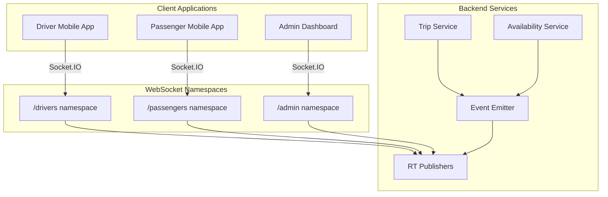
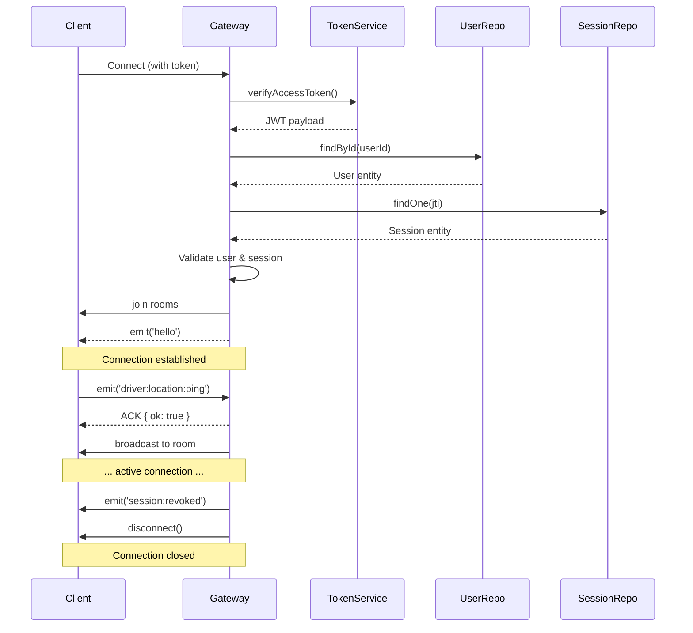

## Overview

Rodando Backend implements a comprehensive WebSocket system using Socket.IO, providing real-time bidirectional communication between the server and clients (drivers, passengers, and admin dashboards).

## Architecture



## Namespaces

The system uses three separate Socket.IO namespaces:

<CardGroup cols={3}>
  <Card title="/drivers" icon="car">
    For driver mobile apps
    - Trip assignments
    - Location updates
    - Status changes
  </Card>
  <Card title="/passengers" icon="user">
    For passenger apps
    - Trip status updates
    - Driver location
    - ETA updates
  </Card>
  <Card title="/admin" icon="shield-halved">
    For admin dashboards
    - System monitoring
    - Trip tracking
    - Driver management
  </Card>
</CardGroup>

## Connection & Authentication

### Driver Connection

```typescript src/realtime/gateways/driver-availability.gateway.ts:57-112
async handleConnection(client: Socket) {
  try {
    // 1. Extract token from handshake
    const token = client.handshake.auth?.token ||
      client.handshake.headers?.authorization?.replace(/^Bearer\s+/i, '');
    if (!token) throw new Error('Missing token');

    // 2. Verify JWT access token
    const payload = this.tokenService.verifyAccessToken<any>(token);
    const userId = payload?.sub;
    const sid = payload?.sid;  // Session ID
    if (!userId || !sid) throw new Error('Missing sub/sid');

    // 3. Validate user and session
    const user = await this.usersRepo.findById(userId);
    if (!user) throw new Error('User not found');
    if (user.userType !== UserType.DRIVER) throw new Error('Wrong userType');
    if (user.status !== UserStatus.ACTIVE) throw new Error('User inactive');

    const session = await this.sessionRepo.findOne({ where: { jti: sid } });
    if (!session || session.revoked) throw new Error('Invalid session');
    if (session.accessTokenExpiresAt && session.accessTokenExpiresAt < new Date()) {
      throw new Error('Access expired');
    }

    // 4. Store user data in socket
    const data: DriverSocketData = {
      userId,
      driverId: userId,
      jti: sid,
      sessionId: session.id,
      userType: 'DRIVER',
    };
    client.data = data;

    // 5. Join rooms
    await client.join(Rooms.driver(userId));
    await client.join(`session:${sid}`);

    this.logger.log(
      `Driver WS connected user=${userId} sid=${sid} nsp=${client.nsp?.name} rooms=[${Rooms.driver(userId)}, session:${sid}]`,
    );
    
    // 6. Send hello event
    client.emit('hello', { ok: true, nsp: '/drivers' });
  } catch (e) {
    this.logger.warn(`Driver WS handshake failed: ${e.message}`);
    client.disconnect(true);
  }
}
```

<CodeGroup>
```typescript Client Connection (JavaScript/TypeScript)
import io from 'socket.io-client';

const socket = io('http://localhost:3000/drivers', {
  auth: {
    token: accessToken  // JWT access token
  },
  transports: ['websocket'],
});

socket.on('connect', () => {
  console.log('Connected to /drivers namespace');
});

socket.on('hello', (data) => {
  console.log('Handshake successful:', data);
});
```

```swift Client Connection (iOS Swift)
import SocketIO

let manager = SocketManager(
  socketURL: URL(string: "http://localhost:3000")!,
  config: [
    .log(true),
    .forceWebsockets(true),
    .connectParams(["token": accessToken])
  ]
)

let socket = manager.socket(forNamespace: "/drivers")

socket.on(clientEvent: .connect) { data, ack in
  print("Connected to /drivers namespace")
}

socket.on("hello") { data, ack in
  print("Handshake successful: \(data)")
}

socket.connect()
```

```kotlin Client Connection (Android Kotlin)
import io.socket.client.IO
import io.socket.client.Socket
import org.json.JSONObject

val opts = IO.Options().apply {
    transports = arrayOf("websocket")
    auth = mapOf("token" to accessToken)
}

val socket = IO.socket("http://localhost:3000/drivers", opts)

socket.on(Socket.EVENT_CONNECT) {
    Log.d("Socket", "Connected to /drivers namespace")
}

socket.on("hello") { args ->
    val data = args[0] as JSONObject
    Log.d("Socket", "Handshake successful: $data")
}

socket.connect()
```
</CodeGroup>

### Passenger Connection

```typescript src/realtime/gateways/passenger.gateway.ts:35-89
async handleConnection(client: Socket) {
  try {
    // 1. Extract token
    const token = client.handshake.auth?.token ||
      client.handshake.headers?.authorization?.replace(/^Bearer\s+/i, '');
    if (!token) throw new Error('Missing token');

    // 2. Verify JWT
    const payload = this.tokenService.verifyAccessToken<any>(token);
    const userId = payload?.sub;
    const sid = payload?.sid;
    if (!userId || !sid) throw new Error('Missing sub/sid');

    // 3. Validate user
    const user = await this.usersRepo.findById(userId);
    if (!user) throw new Error('User not found');
    if (user.userType !== UserType.PASSENGER) throw new Error('Wrong userType');
    if (user.status !== UserStatus.ACTIVE) throw new Error('User not active');

    // 4. Validate session
    const session = await this.sessionRepo.findOne({ where: { jti: sid } });
    if (!session || session.revoked) throw new Error('Invalid session');

    // 5. Store data and join rooms
    client.data = { passengerId: userId, sid };
    await client.join(Rooms.passenger(userId));
    await client.join(`session:${sid}`);

    this.logger.log(
      `Passenger WS connected user=${userId} sid=${sid} nsp=${client.nsp?.name}`,
    );

    client.emit('hello', { ok: true, nsp: '/passengers' });
  } catch (e) {
    this.logger.warn(`Passenger WS handshake failed: ${e.message}`);
    client.disconnect(true);
  }
}
```

## Rooms System

Socket.IO rooms allow targeted message delivery:

```typescript Room Patterns
// User-specific rooms
Rooms.driver(driverId)        // "driver:{driverId}"
Rooms.passenger(passengerId)  // "passenger:{passengerId}"
Rooms.trip(tripId)            // "trip:{tripId}"

// Session-based rooms
`session:${sessionId}`         // For session revocation

// Broadcast rooms
'admin:drivers'                // All admin dashboards watching drivers
'admin:trips'                  // All admin dashboards watching trips
```

<Info>
  When a client connects, they automatically join their user-specific room and session room.
</Info>

## Event Publishing

### Trip Events

Trip state changes are broadcast to relevant rooms:

```typescript src/realtime/publishers/trip-realtime.publisher.ts:95-119
tripRequested(ev: TripRequestedEvent) {
  const s = ev.snapshot;
  const payload = {
    tripId: s.tripId,
    passengerId: s.passengerId,
    requestedAt: s.requestedAt ?? ev.at,
    pickup: s.pickup ?? null,
    fareEstimatedTotal: s.fareEstimatedTotal ?? null,
    status: 'pending',
  };

  this.logger.log(
    `[PUB] trip:requested -> ${Rooms.passenger(s.passengerId)} trip=${s.tripId}`,
  );

  // Send to passenger
  this.emitTo('/passengers', Rooms.passenger(s.passengerId), 'trip:requested', payload);
  
  // Send to admin dashboard
  this.emitTo('/admin', Rooms.trip(s.tripId), 'trip:requested', payload);
}
```

### Driver Assignment Events

```typescript src/realtime/publishers/trip-realtime.publisher.ts:148-188
driverOffered(ev: DriverOfferedEvent) {
  const ttlSec = Math.max(
    0,
    Math.round((Date.parse(ev.ttlExpiresAt) - Date.now()) / 1000),
  );
  
  const payloadForDriver = {
    assignmentId: ev.assignmentId,
    tripId: ev.tripId,
    ttlSec,
    expiresAt: ev.ttlExpiresAt,
  };

  this.logger.log(
    `[PUB] trip:assignment:offered -> ${Rooms.driver(ev.driverId)} trip=${ev.tripId}`,
  );

  // Send offer to specific driver
  this.emitTo(
    '/drivers',
    Rooms.driver(ev.driverId),
    'trip:assignment:offered',
    payloadForDriver,
  );

  // Notify admin
  this.emitTo('/admin', Rooms.trip(ev.tripId), 'trip:assignment:offered', {
    ...payloadForDriver,
    driverId: ev.driverId,
    vehicleId: ev.vehicleId,
  });
}
```

### Driver Accepted - Notify Passenger

```typescript src/realtime/publishers/trip-realtime.publisher.ts:280-347
async emitDriverAcceptedToPassenger(
  p: DriverAcceptedForPassengerPayload,
): Promise<void> {
  const server = this.wsRegistry.get('/passengers');
  const room = `passenger:${p.passengerId}`;

  if (!server) {
    this.logger.warn('[WS] /passengers server undefined. Skip emit');
    return;
  }

  try {
    // Verify room has connected clients
    const sockets = await server.in(room).fetchSockets();
    this.logger.debug(
      `[WS] emitDriverAcceptedToPassenger room=${room} clients=${sockets.length} trip=${p.tripId}`,
    );

    // Send driver acceptance with full driver/vehicle info
    server.to(room).emit('trip:driver_accepted', {
      tripId: p.tripId,
      at: p.at,
      currentStatus: p.currentStatus,
      driver: p.driver,      // { id, name, phone, rating, profilePictureUrl }
      vehicle: p.vehicle,    // { id, make, model, color, plateNumber, category }
    });

    this.logger.debug(`[WS] emit ok evt=trip:driver_accepted room=${room}`);
  } catch (e) {
    this.logger.warn(
      `[WS] emitDriverAcceptedToPassenger failed room=${room}: ${e.message}`,
    );
  }
}
```

## Client-to-Server Messages

Clients can send messages to update their state:

### Driver Status Update

```typescript src/realtime/gateways/driver-availability.gateway.ts:121-148
@SubscribeMessage('driver:status:update')
async onStatus(
  @MessageBody() body: UpdateDriverStatusDto,
  @ConnectedSocket() client: Socket,
) {
  try {
    const driverId = client.data?.driverId;
    if (!driverId) throw new WsException('Unauthorized');

    // Update driver availability in database
    const updated = await this.availabilityService.updateStatus(driverId, body);

    // Broadcast to all driver's connected clients
    this.server
      .to(`driver:${driverId}`)
      .emit('driver:availability:update', updated);

    // Notify admin dashboards
    this.server
      .to('admin:drivers')
      .emit('driver:availability:update', updated);

    return { ok: true, data: updated };  // ACK to sender
  } catch (e) {
    throw new WsException(e?.message ?? 'status update failed');
  }
}
```

<CodeGroup>
```typescript Client Request
// Driver goes online
socket.emit('driver:status:update', {
  isOnline: true,
  isAvailableForTrips: true,
}, (response) => {
  console.log('Status updated:', response);
});
```

```typescript Server Response (ACK)
{
  ok: true,
  data: {
    id: "avail-uuid",
    driverId: "driver-uuid",
    isOnline: true,
    isAvailableForTrips: true,
    lastLocation: { lat: 23.1136, lng: -82.3666 },
    currentTripId: null,
    availabilityReason: null,
    updatedAt: "2024-03-15T10:30:00Z"
  }
}
```
</CodeGroup>

### Driver Location Update

```typescript src/realtime/gateways/driver-availability.gateway.ts:150-180
@SubscribeMessage('driver:location:ping')
async onLocation(
  @MessageBody() body: UpdateDriverLocationDto,
  @ConnectedSocket() client: Socket,
) {
  try {
    const driverId = client.data?.driverId;
    if (!driverId) throw new WsException('Unauthorized');

    // Intelligent location update (throttled)
    const updated = await this.availabilityService.updateLocation(driverId, body);

    // Broadcast lightweight location update
    this.server.to(`driver:${driverId}`).emit('driver:location:update', {
      driverId,
      lastLocation: updated.lastLocation,
      lastLocationTimestamp: updated.lastLocationTimestamp,
    });

    this.server.to('admin:drivers').emit('driver:location:update', {
      driverId,
      lastLocation: updated.lastLocation,
      lastLocationTimestamp: updated.lastLocationTimestamp,
    });

    return { ok: true };  // ACK
  } catch (e) {
    throw new WsException(e?.message ?? 'location update failed');
  }
}
```

## Event Reference

### Server → Client Events

<AccordionGroup>
  <Accordion title="Trip Events" icon="route">
    **Passenger & Admin receive:**
    
    - `trip:requested` - Trip created
    - `trip:assigning_started` - Driver matching started
    - `trip:driver_accepted` - Driver accepted trip
    - `trip:driver_assigned` - Driver officially assigned
    - `trip:arriving_started` - Driver en route
    - `trip:driver_en_route` - Driver navigation update
    - `trip:driver_arrived_pickup` - Driver at pickup location
    - `trip:started` - Trip in progress
    - `trip:completed` - Trip finished
    - `trip:no_drivers_found` - No drivers available
    
    **Driver receives:**
    
    - `trip:assignment:offered` - New trip offer
    - `trip:assignment:accepted` - Acceptance confirmed
    - `trip:driver_assigned` - Assignment confirmed with passenger info
    - `trip:arriving_started` - Navigation started
    - `trip:started` - Trip in progress
    - `trip:completed` - Trip finished
  </Accordion>

  <Accordion title="Driver Availability Events" icon="signal">
    **Driver & Admin receive:**
    
    - `driver:availability:update` - Availability status changed
    - `driver:location:update` - Location updated
    - `driver:trip:update` - Current trip changed
  </Accordion>

  <Accordion title="System Events" icon="server">
    **All clients receive:**
    
    - `hello` - Connection successful
    - `session:revoked` - Session invalidated (auto-disconnect)
    - `error` - Error occurred
  </Accordion>
</AccordionGroup>

### Client → Server Events

<AccordionGroup>
  <Accordion title="Driver Messages" icon="car">
    - `driver:status:update` - Change online/availability status
    - `driver:location:ping` - Send location update
    - `driver:trip:set` - Set/clear current trip
  </Accordion>

  <Accordion title="Common Messages" icon="message">
    - `ping` - Heartbeat (Socket.IO built-in)
    - `disconnect` - Close connection
  </Accordion>
</AccordionGroup>

## Session Revocation

When a session is revoked (logout, security event), all sockets are disconnected:

```typescript Event Listener for Session Revocation
@OnEvent(AuthEvents.SessionRevoked)
async onSessionRevoked(ev: SessionRevokedEvent) {
  const { sid } = ev;
  const room = `session:${sid}`;

  // Disconnect all sockets in this session room
  for (const ns of ['/drivers', '/passengers', '/admin']) {
    const server = this.wsRegistry.get(ns);
    if (!server) continue;

    const sockets = await server.in(room).fetchSockets();
    for (const socket of sockets) {
      this.logger.log(`Disconnecting socket ${socket.id} from ${ns} (session revoked)`);
      socket.emit('session:revoked', { reason: ev.reason });
      socket.disconnect(true);
    }
  }
}
```

## Connection Lifecycle



## Best Practices

<CardGroup cols={2}>
  <Card title="Reconnection Strategy" icon="arrows-rotate">
    Implement exponential backoff for reconnections:
    - Initial delay: 1s
    - Max delay: 30s
    - Always use fresh access token on reconnect
  </Card>
  <Card title="Token Refresh" icon="key">
    Monitor token expiration:
    - Refresh token before access token expires
    - Reconnect with new token after refresh
    - Handle `session:revoked` by redirecting to login
  </Card>
  <Card title="Event Handling" icon="bolt">
    Robust event listeners:
    - Always handle errors in event handlers
    - Implement timeout for ACK responses
    - Log all unexpected disconnections
  </Card>
  <Card title="Heartbeat Monitoring" icon="heart-pulse">
    Track connection health:
    - Monitor `ping`/`pong` events
    - Detect network interruptions
    - Notify user of connection issues
  </Card>
</CardGroup>

## Testing WebSocket Connections

<CodeGroup>
```bash Using wscat (CLI)
npm install -g wscat

wscat -c "ws://localhost:3000/drivers" \
  -H "Authorization: Bearer {accessToken}"

# Once connected:
> {"event":"driver:status:update","data":{"isOnline":true}}
```

```javascript Using Postman
// 1. Create WebSocket Request
// 2. URL: ws://localhost:3000/drivers
// 3. Add header: Authorization: Bearer {accessToken}
// 4. Connect
// 5. Send messages:
{
  "event": "driver:location:ping",
  "data": {
    "lat": 23.1136,
    "lng": -82.3666
  }
}
```
</CodeGroup>

## Monitoring & Debugging

The system includes detailed logging:

```typescript Debug Logs
// Connection
[DriversGateway] Driver WS connected user=abc123 sid=xyz789 nsp=/drivers rooms=[driver:abc123, session:xyz789]

// Event Publishing
[PUB] trip:assignment:offered -> driver:abc123 trip=trip-uuid
[WS] emitTo[quick] ns=/drivers room=driver:abc123 size=2 evt=trip:assignment:offered
[WS] emitTo[fetch] ns=/drivers room=driver:abc123 clients=2 evt=trip:assignment:offered
[WS] emit ok ns=/drivers room=driver:abc123 evt=trip:assignment:offered

// Disconnection
[DriversGateway] Driver WS disconnected user=abc123 sid=xyz789 nsp=/drivers
```

## Related Resources

<CardGroup cols={2}>
  <Card title="Authentication" icon="shield-check" href="/concepts/authentication">
    Learn about JWT token authentication
  </Card>
  <Card title="Trip Lifecycle" icon="route" href="/concepts/trip-lifecycle">
    See how real-time events follow trip states
  </Card>
  <Card title="Driver Matching" icon="users-between-lines" href="/concepts/driver-matching">
    Understand driver assignment flow
  </Card>
</CardGroup>