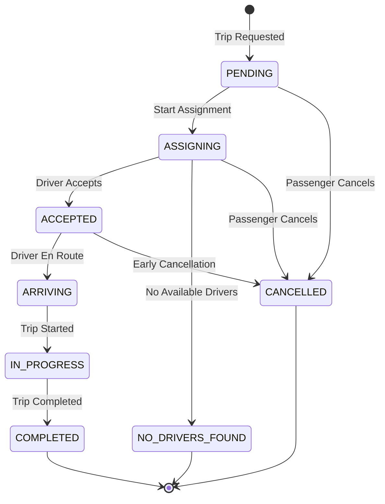

## Overview

The trip lifecycle in Rodando Backend follows a well-defined state machine, ensuring data consistency and proper event tracking throughout the journey.

## Trip States



## State Definitions

<AccordionGroup>
  <Accordion title="PENDING" icon="clock">
    Initial state when a passenger creates a trip request.
    
    **Characteristics:**
    - Fare estimate calculated
    - Pickup and destination stored
    - No driver assigned
    - Waiting for assignment to begin
  </Accordion>

  <Accordion title="ASSIGNING" icon="magnifying-glass">
    System is actively searching for and offering trip to available drivers.
    
    **Characteristics:**
    - Sequential driver offers with TTL
    - Real-time matching algorithm running
    - Trip can timeout to NO_DRIVERS_FOUND
  </Accordion>

  <Accordion title="ACCEPTED" icon="check">
    Driver has accepted the trip assignment.
    
    **Characteristics:**
    - Driver and vehicle assigned
    - Waiting for driver to start navigation
    - Driver can cancel (with penalties)
  </Accordion>

  <Accordion title="ARRIVING" icon="location-arrow">
    Driver is en route to pickup location.
    
    **Characteristics:**
    - ETA tracking active
    - Real-time location updates
    - Passenger can see driver approaching
  </Accordion>

  <Accordion title="IN_PROGRESS" icon="car">
    Trip is actively in progress (passenger on board).
    
    **Characteristics:**
    - Route tracking active
    - Distance/time accumulating
    - Final fare being calculated
  </Accordion>

  <Accordion title="COMPLETED" icon="flag-checkered">
    Trip successfully finished.
    
    **Characteristics:**
    - Final fare calculated
    - Payment processed
    - Driver availability restored
  </Accordion>

  <Accordion title="CANCELLED" icon="ban">
    Trip cancelled by passenger or system.
  </Accordion>

  <Accordion title="NO_DRIVERS_FOUND" icon="user-slash">
    No drivers available or accepted within timeout period.
  </Accordion>
</AccordionGroup>

## Phase 1: Trip Request

### Creating a Trip

<CodeGroup>
```bash cURL Request
curl -X POST http://localhost:3000/trips \
  -H "Authorization: Bearer {accessToken}" \
  -H "Content-Type: application/json" \
  -d '{
    "passengerId": "user-uuid",
    "paymentMode": "CASH",
    "vehicleCategoryId": "category-uuid",
    "serviceClassId": "service-uuid",
    "pickupPoint": {
      "lat": 23.1136,
      "lng": -82.3666
    },
    "pickupAddress": "Havana, Cuba",
    "stops": [
      {
        "seq": 1,
        "point": { "lat": 23.1330, "lng": -82.3830 },
        "address": "Vedado, Havana"
      }
    ]
  }'
```

```typescript Service Implementation
// src/modules/trip/services/trip.service.ts:158-356
async requestTrip(
  dto: CreateTripDto,
  idemKey?: string,
): Promise<ApiResponseDto<TripResponseDto>> {
  // Idempotency check
  if (idemKey) {
    const claim = await this.idemRepo.claimOrGet({
      key: idemKey,
      method: 'POST',
      endpoint: '/trips',
      userId: dto.passengerId,
      requestHash: hashCreateTripPayload(dto),
      leaseSeconds: 30,
      windowSeconds: 3600,
    });

    if (claim.decision === 'returnStoredSuccess') {
      return claim.responseBody as ApiResponseDto<TripResponseDto>;
    }
  }

  // Transaction: Create trip, stops, calculate estimate
  const created = await withQueryRunnerTx(
    this.dataSource,
    async (_qr, manager) => {
      // 1. Check for active trip
      const active = await this.tripRepo.findActiveByPassenger(dto.passengerId);
      if (active) throw new BadRequestException('Passenger already has an active trip');

      // 2. Create trip entity
      const trip = await this.tripRepo.createAndSave({
        passenger: { id: dto.passengerId } as any,
        currentStatus: TripStatus.PENDING,
        paymentMode: dto.paymentMode,
        requestedAt: new Date(),
        pickupPoint: toGeoPoint(dto.pickupPoint.lat, dto.pickupPoint.lng),
        pickupAddress: dto.pickupAddress ?? null,
      }, manager);

      // 3. Create stops
      await this.tripStopsRepo.createManyForTrip(trip.id, preparedStops, manager);

      // 4. Calculate fare estimate
      const est = await this.pricing.estimateForRequest({
        vehicleCategoryId: dto.vehicleCategoryId,
        serviceClassId: dto.serviceClassId,
        pickup: trip.pickupPoint,
        stops: preparedStops.map(s => s.point),
        currency: 'CUP',
        at: requestedAt,
        manager,
      });

      // 5. Persist estimate snapshot
      await this.tripRepo.applyEstimateSnapshot(trip.id, est, manager);

      // 6. Event store
      await this.tripEventsRepo.append(
        trip.id,
        TripEventType.TRIP_REQUESTED,
        requestedAt,
        { /* metadata */ },
        manager,
      );

      return trip;
    },
    { logLabel: 'trip.request' },
  );

  // Emit domain event
  this.events.emit(TripDomainEvents.TripRequested, {
    at: new Date().toISOString(),
    snapshot: toTripSnapshot(full),
  });

  return { success: true, message: 'Trip requested', data: toTripResponseDto(full) };
}
```
</CodeGroup>

<Info>
  The system supports **idempotency keys** to prevent duplicate trip creation from network retries.
</Info>

### Fare Estimation

Before creating a trip, clients can request a fare estimate:

```typescript src/modules/trip/services/trip.service.ts:359-377
async estimateTrip(dto: EstimateTripDto): Promise<TripQuoteDto> {
  const est = await this.tripHelpers.estimateForRequest({
    vehicleCategoryId: dto.vehicleCategoryId,
    serviceClassId: dto.serviceClassId,
    pickup: toGeoPoint(dto.pickup.lat, dto.pickup.lng),
    stops: (dto.stops ?? []).map((s) => toGeoPoint(s.lat, s.lng)),
    currency: dto.currency ?? 'CUP',
    manager: undefined,
  });

  return {
    currency: est.currency,
    surgeMultiplier: est.surgeMultiplier,
    totalEstimated: est.totalEstimated,
    breakdown: est.breakdown,
  };
}
```

## Phase 2: Driver Assignment

### Start Assignment Process

```typescript src/modules/trip/services/trip.service.ts:378-517
async startAssigning(tripId: string, dto: StartAssigningDto) {
  const now = new Date();

  // 1. Transition to ASSIGNING state
  const updated = await withQueryRunnerTx(
    this.dataSource,
    async (_qr, manager) => {
      const t = await this.tripRepo.lockByIdForUpdate(tripId, manager);
      if (!t) throw new NotFoundException('Trip not found');
      if (t.currentStatus !== TripStatus.PENDING) {
        throw new ConflictException('Trip must be pending to start assigning');
      }

      await this.tripRepo.moveToAssigningWithLock(tripId, manager);
      await this.tripEventsRepo.append(
        tripId,
        TripEventType.ASSIGNING_STARTED,
        now,
        { previous_status: TripStatus.PENDING },
        manager,
      );

      return trip;
    },
    { logLabel: 'trip.assign.start' },
  );

  // 2. Run first matching iteration
  const firstOffer = await this.tripHelpers.runMatchingOnce(tripId, {
    searchRadiusMeters: 5000,
    maxCandidates: 10,
    offerTtlSeconds: 20,
  });

  // 3. If no candidates, mark as NO_DRIVERS_FOUND
  if (!firstOffer.assignmentId) {
    await this.tripRepo.moveToNoDriversFoundWithLock(tripId, now, manager);
    this.events.emit(TripDomainEvents.NoDriversFound, {
      at: now.toISOString(),
      tripId,
      reason: 'no_candidates_initial_round',
    });
  }

  return { success: true, data: toTripResponseDto(updated) };
}
```

### Assignment Entity

```typescript Trip Assignment Structure
{
  id: string;                       // Assignment UUID
  trip: Trip;                       // Associated trip
  driver: User;                     // Offered driver
  vehicle: Vehicle;                 // Driver's vehicle
  status: AssignmentStatus;         // OFFERED, ACCEPTED, REJECTED, EXPIRED
  offeredAt: Date;                  // When offer was made
  respondedAt?: Date;               // When driver responded
  ttlExpiresAt?: Date;              // Offer expiration time
  metadata?: {
    etaSeconds?: number;
    distanceMeters?: number;
  };
}
```

### Driver Accept Assignment

```typescript src/modules/trip/services/trip.service.ts:519-627
async acceptAssignment(
  assignmentId: string,
  authDriverId: string,
): Promise<ApiResponseDto<TripResponseDto>> {
  const now = new Date();

  const result = await withQueryRunnerTx(
    this.dataSource,
    async (_qr, manager) => {
      // 1. Accept offer with locks
      const accepted = await this.tripAssignmentRepo.acceptOfferWithLocksForDriver(
        assignmentId,
        authDriverId,
        now,
        manager,
      );
      if (!accepted) throw new NotFoundException('Assignment not found');

      const { tripId, driverId, vehicleId } = accepted;

      // 2. Update trip with driver assignment
      await this.tripRepo.assignDriver(
        tripId,
        { driverId, vehicleId, acceptedAt: now },
        manager,
      );

      // 3. Update driver availability
      await this.availabilityRepository.setCurrentTripByDriverId(
        driverId,
        tripId,
        manager,
      );

      // 4. Cancel other pending offers
      await this.tripAssignmentRepo.cancelOtherOffers(tripId, assignmentId, manager);

      // 5. Event store
      await this.tripEventsRepo.append(
        tripId,
        TripEventType.DRIVER_ACCEPTED,
        now,
        { assignment_id: assignmentId, driver_id: driverId, vehicle_id: vehicleId },
        manager,
      );

      return { tripId, driverId, vehicleId };
    },
    { logLabel: 'trip.assignment.accept' },
  );

  // Emit domain events
  this.events.emit(TripDomainEvents.DriverAccepted, {
    at: now.toISOString(),
    tripId: result.tripId,
    assignmentId,
    driverId: result.driverId,
    vehicleId: result.vehicleId,
  });

  return { success: true, message: 'Assignment accepted', data: toTripResponseDto(full) };
}
```

## Phase 3: Driver En Route

### Start Arriving

```typescript src/modules/trip/services/trip.service.ts:881-989
async startArriving(
  tripId: string,
  dto: StartArrivingDto,
): Promise<ApiResponseDto<TripResponseDto>> {
  const now = new Date();

  await withQueryRunnerTx(
    this.dataSource,
    async (_qr, manager) => {
      // 1. Lock and validate state
      const row = await this.tripRepo.getStatusAndDriverForUpdate(tripId, manager);
      if (!row) throw new NotFoundException('Trip not found');
      if (row.status !== TripStatus.ACCEPTED) {
        throw new ConflictException('Trip must be accepted to move to arriving');
      }

      // 2. Update to ARRIVING state
      await this.tripRepo.setArriving(tripId, now, dto.etaMinutes ?? null, manager);

      // 3. Event store
      await this.tripEventsRepo.append(
        tripId,
        TripEventType.DRIVER_EN_ROUTE,
        now,
        {
          driver_id: row.driverId,
          eta_min: dto.etaMinutes,
          driver_position: dto.driverLat && dto.driverLng
            ? { lat: dto.driverLat, lng: dto.driverLng }
            : null,
        },
        manager,
      );
    },
    { logLabel: 'trip.arriving.start' },
  );

  // Emit events
  this.events.emit(TripDomainEvents.ArrivingStarted, {
    at: now.toISOString(),
    snapshot: toTripSnapshot(full),
  });

  return { success: true, message: 'Driver en camino', data: toTripResponseDto(full) };
}
```

### Mark Arrived at Pickup

```typescript src/modules/trip/services/trip.service.ts:991-1073
async markArrivedPickup(
  tripId: string,
  driverId: string,
): Promise<ApiResponseDto<TripResponseDto>> {
  const now = new Date();

  await withQueryRunnerTx(
    this.dataSource,
    async (_qr, manager) => {
      const row = await this.tripRepo.getStatusAndDriverForUpdate(tripId, manager);
      if (![TripStatus.ACCEPTED, TripStatus.ARRIVING].includes(row.status)) {
        throw new ConflictException('Trip must be accepted/arriving to mark arrival');
      }

      await this.tripRepo.setArrivedPickup(tripId, now, manager);
      await this.tripEventsRepo.append(
        tripId,
        TripEventType.DRIVER_ARRIVED_PICKUP,
        now,
        { driver_id: driverId },
        manager,
      );
    },
    { logLabel: 'trip.arrived_pickup' },
  );

  this.events.emit(TripDomainEvents.DriverArrivedPickup, {
    at: now.toISOString(),
    tripId,
    driverId,
  });

  return { success: true, message: 'Driver arrival registered', data: toTripResponseDto(full) };
}
```

## Phase 4: Trip in Progress

### Start Trip

```typescript src/modules/trip/services/trip.service.ts:1075-1147
async startTripInProgress(
  tripId: string,
  driverId: string,
): Promise<ApiResponseDto<TripResponseDto>> {
  const now = new Date();

  await withQueryRunnerTx(
    this.dataSource,
    async (_qr, manager) => {
      const row = await this.tripRepo.getStatusAndDriverForUpdate(tripId, manager);
      if (![TripStatus.ACCEPTED, TripStatus.ARRIVING].includes(row.status)) {
        throw new ConflictException('Trip must be accepted/arriving to start');
      }

      await this.tripRepo.startTrip(tripId, now, manager);
      await this.tripEventsRepo.append(
        tripId,
        TripEventType.TRIP_STARTED,
        now,
        { driver_id: driverId },
        manager,
      );
    },
    { logLabel: 'trip.start' },
  );

  this.events.emit(TripDomainEvents.TripStarted, {
    at: now.toISOString(),
    tripId,
    driverId,
  });

  return { success: true, message: 'Trip started', data: toTripResponseDto(full) };
}
```

## Phase 5: Trip Completion

### Complete Trip

```typescript src/modules/trip/services/trip.service.ts:1149-1323
async completeTrip(
  tripId: string,
  dto: {
    driverId: string;
    actualDistanceKm?: number;
    actualDurationMin?: number;
    extraFees?: number;
    waitingTimeMinutes?: number;
    waitingReason?: string;
  },
): Promise<ApiResponseDto<TripResponseDto>> {
  const now = new Date();

  await withQueryRunnerTx(
    this.dataSource,
    async (_qr, manager) => {
      // 1. Lock and validate
      const lock = await this.tripRepo.getStatusAndDriverForUpdate(tripId, manager);
      if (lock.status !== TripStatus.IN_PROGRESS) {
        throw new ConflictException('Trip must be in_progress to complete');
      }

      // 2. Get trip with pricing data
      const t = await this.tripRepo.findByIdWithPricing(tripId, manager);

      // 3. Calculate actual distance/duration (fallback to estimate)
      let dKm = dto.actualDistanceKm ?? t.fareDistanceKm;
      let dMin = dto.actualDurationMin ?? t.fareDurationMin;

      if (!dKm || !dMin) {
        const metrics = this.pricing.estimateRouteMetrics(routePoints);
        dKm = dKm ?? metrics.distanceKm;
        dMin = dMin ?? metrics.durationMin;
      }

      // 4. Compute final fare (includes extras, waiting time)
      const final = await this.pricing.computeFinalForCompletion(
        t,
        dKm,
        dMin,
        dto.extraFees ?? null,
        {
          waitingTimeMinutes: dto.waitingTimeMinutes,
          waitingReason: dto.waitingReason,
        },
        manager,
      );

      // 5. Persist completion data
      await this.tripRepo.completeTrip(
        tripId,
        {
          distanceKm: final.distanceKm,
          durationMin: final.durationMin,
          fareTotal: final.fareTotal,
          surgeMultiplier: final.surgeMultiplier,
          breakdown: final.breakdown,
          completedAt: now,
        },
        manager,
      );

      // 6. Create snapshot
      await this.tripSnapshotRepo.upsertForTrip({ tripId, driverName, vehiclePlate, ... }, manager);

      // 7. Restore driver availability
      await this.availabilityService.onTripEnded(lock.driverId, t.vehicle?.id, manager);

      // 8. Event store
      await this.tripEventsRepo.append(
        tripId,
        TripEventType.TRIP_COMPLETED,
        now,
        { driver_id: lock.driverId, fare_total: final.fareTotal, currency: final.currency },
        manager,
      );

      // 9. Create order for CASH payments
      if (t.paymentMode === PaymentMode.CASH) {
        await this.orderService.createCashOrderOnTripClosureTx(manager, tripId, { currencyDefault: final.currency });
      }
    },
    { logLabel: 'trip.complete' },
  );

  this.events.emit(TripDomainEvents.TripCompleted, {
    at: now.toISOString(),
    tripId,
    driverId,
    fareTotal: completedFareTotal,
    currency: completedCurrency,
  });

  return { success: true, message: 'Trip completed', data: toTripResponseDto(full) };
}
```

<Warning>
  All state transitions use database-level row locking (`FOR UPDATE`) to prevent race conditions.
</Warning>

## Event Sourcing

Every significant trip event is stored in the `trip_events` table:

```typescript Event Types
enum TripEventType {
  TRIP_REQUESTED = 'trip_requested',
  ASSIGNING_STARTED = 'assigning_started',
  DRIVER_OFFERED = 'driver_offered',
  DRIVER_ACCEPTED = 'driver_accepted',
  DRIVER_REJECTED = 'driver_rejected',
  DRIVER_ASSIGNED = 'driver_assigned',
  ASSIGNMENT_EXPIRED = 'assignment_expired',
  NO_DRIVERS_FOUND = 'no_drivers_found',
  DRIVER_EN_ROUTE = 'driver_en_route',
  DRIVER_ARRIVED_PICKUP = 'driver_arrived_pickup',
  TRIP_STARTED = 'trip_started',
  TRIP_COMPLETED = 'trip_completed',
}
```

## Related Resources

<CardGroup cols={2}>
  <Card title="Driver Matching" icon="users" href="/concepts/driver-matching">
    Learn how drivers are matched to trips
  </Card>
  <Card title="Real-Time Updates" icon="satellite-dish" href="/concepts/real-time-communication">
    See how status updates are broadcasted
  </Card>
  <Card title="API Reference" icon="code" href="/api/trips/create-trip">
    Explore trip endpoints
  </Card>
</CardGroup>